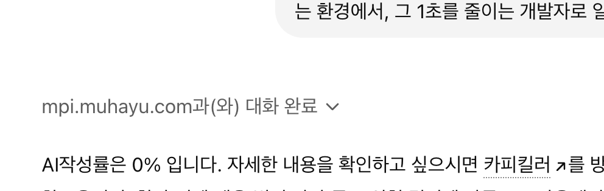

# Job Application Agent Suite

[English README](./README.en.md)

한국어 자소서와 커버레터 작성을 위한 멀티 에이전트 툴킷입니다. 회사/직무 분석, 경험 발굴, 문항 매칭, 초안 작성, 톤 보정, AI스러운 문장 점검, 최종 패키징까지 하나의 흐름으로 다룰 수 있습니다.



###  추가 검토 과정에서 GPT Killer 결과가 0%로 나온 예시 스크린샷!!


> 1분 사용법
>
> 1. 저장소를 받습니다.
> 2. `python3 scripts/use_agent.py --list`로 에이전트 목록을 봅니다.
> 3. `python3 scripts/use_agent.py --agent agent-00 --input templates/agent-00-input.sample.json`로 프롬프트 하나를 출력해봅니다.
> 4. `examples/` 폴더를 열어 샘플 초안과 QA 결과 형식을 확인합니다.
> 5. Codex에서 skill처럼 바로 부르고 싶다면, 이 폴더를 먼저 `~/.codex/skills/job-application-agent-suite`에 넣습니다.
> 6. 그다음 Codex에서 `job-application-agent-suite 써서 자소서 초안부터 도와줘`처럼 호출합니다.

> 중요
>
> 이 저장소가 만들어주는 결과는 최종 제출본이 아니라 초안, 분석안, 수정안에 가깝습니다.
> 반드시 본인이 다시 읽고 다듬어야 하며, 가능하면 다른 AI나 사람에게 추가 피드백을 받아 최종 검토를 거친 뒤 제출하는 것을 권장합니다.

## Overview

이 저장소는 자소서 작성 과정을 아래 단계로 분리합니다.

1. `agent-00` 입력 검증
2. `agent-01a` 산업 분석
3. `agent-01b` 회사 분석
4. `agent-01c` 직무 분석
5. `agent-01` 분석 종합
6. `agent-02a` 코퍼스 스캔 및 재사용 경험 추천
7. `agent-02` 경험 카드화
8. `agent-03` 문항-경험 매칭
9. `agent-03b` 정제 및 꼬리질문
10. `agent-03c` 수치 근거 검증
11. `agent-04` 초안 작성
12. `agent-05` 톤 보정
13. `agent-06` AI 스타일 및 QA 점검
14. `agent-07` 최종 패키징

핵심 방향은 빠른 자동 생성보다 단계별 검증과 재사용 가능한 작성 파이프라인에 가깝습니다.

## Use Cases

- 한국 기업 자소서를 반복적으로 작성하는 흐름 정리
- 기존 자소서 파일에서 재사용 가능한 경험 추출
- 문항별로 맞는 경험을 구조적으로 매칭
- 초안 이후 반복 표현, 선언형 문장, 과장된 톤 점검
- Codex skill 또는 독립형 프롬프트/스크립트 세트로 사용

<details>
<summary>Repository structure</summary>

```text
job-application-agent-suite/
├── README.md
├── README.en.md
├── CONTRIBUTING.md
├── examples/
├── LICENSE
├── SKILL.md
├── agents/
│   └── openai.yaml
├── references/
├── scripts/
└── templates/
```

- `references/`: 단계별 에이전트 프롬프트
- `scripts/`: 파이프라인 보조 스크립트
- `templates/`: 샘플 입력 JSON
- `examples/`: 초보자용 샘플 산출물
- `SKILL.md`: Codex skill 운영 규칙

</details>

<details>
<summary>Requirements and platform support</summary>

- macOS 또는 Linux
- Python 3.9+
- UTF-8 터미널 환경

지원되는 코퍼스 스캔 형식:

- `.txt`
- `.md`
- `.markdown`
- `.rst`
- `.docx`

현재 직접 지원하지 않는 형식:

- `.pdf`
- `.hwp`

예시:

```bash
brew install python ripgrep git
```

Windows는 아예 불가능한 상태는 아닙니다. 현재 스크립트들은 대부분 표준 Python과 `pathlib` 기반이라서 동작 가능성이 높지만, 문서의 기본 경로 예시와 설치 예시는 macOS/Linux 기준입니다. Windows에서는 경로만 Windows 형식으로 바꿔서 사용하는 것이 현실적인 방식입니다.

예시:

```powershell
py scripts\use_agent.py --list
py scripts\scan_experience_corpus.py --path "$HOME\Desktop\취업\자기소개서"
```

Windows 빠른 시작 예시:

```powershell
git clone https://github.com/HyunWoo9930/job-application-agent-suite.git
cd job-application-agent-suite
py scripts\use_agent.py --list
py scripts\use_agent.py --agent agent-00 --input templates\agent-00-input.sample.json
```

</details>

## Quick Start

```bash
git clone https://github.com/HyunWoo9930/job-application-agent-suite.git
cd job-application-agent-suite
python3 scripts/use_agent.py --list
```

처음 보는 사용자는 아래 순서만 따라해도 전체 감을 빠르게 잡을 수 있습니다.

<details open>
<summary>Beginner walkthrough</summary>

### 1. 무엇을 준비하면 되나요?

아래 3가지만 있으면 됩니다.

- 지원할 회사명과 직무명
- 자소서 문항 1개와 글자 수 제한
- 내가 했던 경험 메모 몇 줄

예시:

- 회사명: `네이버`
- 직무명: `백엔드 개발자`
- 문항: `지원 동기와 입사 후 기여 방안을 작성해 주세요.`
- 글자 수: `800`
- 경험 메모: `결제 API 병목 개선`, `응답시간 35% 단축`, `장애 대응 자동화`

### 2. 가장 먼저 해볼 명령

아래 명령은 "어떤 에이전트가 들어 있는지"부터 보여줍니다.

```bash
python3 scripts/use_agent.py --list
```

### 3. 샘플 입력으로 프롬프트 하나 출력해보기

아래 명령은 입력 검증용 에이전트 프롬프트를 바로 보여줍니다.

```bash
python3 scripts/use_agent.py --agent agent-00 --input templates/agent-00-input.sample.json
```

여기서 보이는 긴 텍스트가 실제로 LLM에게 넣을 프롬프트입니다.

### 4. 문항 하나 기준으로 실행 폴더 만들기

```bash
mkdir -p ~/job_runs/naver_backend/Q1
python3 scripts/orchestrate_pipeline.py \
  --run-dir ~/job_runs/naver_backend/Q1 \
  --init-run-dir \
  --input templates/pipeline-state.sample.json
```

### 5. 어떤 파일이 생겼는지 확인하기

```bash
ls -la ~/job_runs/naver_backend/Q1
```

정상이라면 아래 같은 파일이 생깁니다.

- `state.json`: 현재 진행 상태
- `04_draft.txt`: 초안 저장용
- `05_tone.txt`: 톤 보정본 저장용
- `06_qa.json`: QA 결과 저장용
- `07_package.md`: 최종 패키지 저장용

### 6. 기존 자소서 폴더가 있다면 경험 후보 뽑기

```bash
python3 scripts/scan_experience_corpus.py \
  --path ~/Desktop/취업/자기소개서 \
  --write-output /tmp/corpus_candidates.json
```

이 명령을 실행하면 재사용하기 좋아 보이는 경험 후보가 JSON으로 출력됩니다.

### 7. 이미 써둔 초안이 있다면 바로 검사하기

```bash
python3 scripts/char_window_check.py --file /tmp/draft.txt --char-limit 800
python3 scripts/ai_style_checker.py --file /tmp/draft.txt
```

### 8. 이 저장소를 어떻게 쓰는 건가요?

가장 쉬운 사용 방식은 아래 흐름입니다.

1. `use_agent.py`로 원하는 단계의 프롬프트를 출력
2. 그 프롬프트를 Codex/Claude/OpenAI 같은 모델에 넣기
3. 결과를 `state.json`이나 초안 파일에 반영
4. 마지막에 길이 검사와 AI 스타일 검사를 실행

</details>

<details>
<summary>초보자에게 추천하는 파일 열어보기 순서</summary>

1. `templates/agent-00-input.sample.json`
2. `templates/pipeline-state.sample.json`
3. `examples/naver-backend-q1/04_draft.sample.txt`
4. `examples/naver-backend-q1/06_ai_style_report.sample.txt`
5. `examples/naver-backend-q1/07_package.sample.md`

</details>

특정 프롬프트 출력:

```bash
python3 scripts/use_agent.py --agent agent-01
python3 scripts/use_agent.py --agent agent-04
python3 scripts/use_agent.py --agent feedback
```

샘플 입력과 함께 출력:

```bash
python3 scripts/use_agent.py --agent agent-00 --input templates/agent-00-input.sample.json
python3 scripts/use_agent.py --agent agent-06 --input templates/agent-06-input-from-existing-draft.sample.json
```

이 스크립트는 LLM API를 호출하지 않고, 각 단계에서 사용할 프롬프트를 출력합니다.

## Codex Skill Installation

```bash
mkdir -p ~/.codex/skills
cp -R /path/to/job-application-agent-suite ~/.codex/skills/
python3 ~/.codex/skills/job-application-agent-suite/scripts/use_agent.py --list
```

중요:

- 저장소를 `git clone`만 해도 로컬 스크립트 실행과 예시 확인은 가능합니다.
- 하지만 Codex에서 `job-application-agent-suite`를 설치된 skill처럼 바로 부르려면 `~/.codex/skills/job-application-agent-suite` 경로에 있어야 합니다.

설치가 끝나면 Codex에게 아래처럼 바로 요청할 수 있습니다.

```text
job-application-agent-suite 써서 네이버 백엔드 자소서 분석 시작해줘.
```

```text
이 스킬로 회사 분석만 먼저 해줘.
```

```text
job-application-agent-suite 불러서 agent-06만 돌려줘.
```

핵심은 스킬 이름을 함께 말해주는 것입니다. 그러면 "이 저장소 안의 프롬프트와 규칙을 사용해서 진행해달라"는 뜻이 더 분명해집니다.

<details>
<summary>Codex에서 이렇게 부르면 됩니다</summary>

- `job-application-agent-suite 써서 삼성전자 DS 직무 분석해줘`
- `job-application-agent-suite로 자소서 문항 하나만 초안 써줘`
- `job-application-agent-suite 불러서 기존 초안 QA만 해줘`
- `이 스킬로 경험 카드화부터 해줘`

</details>

<details>
<summary>Scripts</summary>

### `scripts/use_agent.py`

에이전트 프롬프트 출력과 `{{variable}}` 치환을 담당합니다.

```bash
python3 scripts/use_agent.py --agent agent-02a --input templates/agent-02a-input.sample.json
```

### `scripts/scan_experience_corpus.py`

기존 자소서/노트 폴더를 스캔해 재사용 가능한 경험 후보를 추출합니다.

```bash
python3 scripts/scan_experience_corpus.py \
  --path ~/Desktop/취업/자기소개서 \
  --write-output /tmp/corpus_candidates.json
```

출력에는 `scanned_experience_list`, `suggested_for_use_now`, `candidates`가 포함됩니다.

### `scripts/orchestrate_pipeline.py`

문항별 실행 디렉터리와 `state.json`을 관리합니다.

```bash
python3 scripts/orchestrate_pipeline.py \
  --run-dir ~/job_runs/naver_backend/Q1 \
  --init-run-dir \
  --input templates/pipeline-state.sample.json
```

### `scripts/persist_analysis_cache.py`

회사/직무 분석 결과를 캐시에 저장하거나 다시 불러옵니다.

```bash
python3 scripts/persist_analysis_cache.py \
  --input templates/pipeline-state.sample.json \
  --mode save
```

### `scripts/char_window_check.py`

최종 글이 `N-20 .. N` 범위에 들어오는지 검사합니다.

```bash
python3 scripts/char_window_check.py --file /tmp/draft.txt --char-limit 800
```

### `scripts/ai_style_checker.py`

반복 표현, 선언형 어미, 긴 문장, 반복 시작 구문 등을 바탕으로 AI스러운 패턴을 점검합니다.

```bash
python3 scripts/ai_style_checker.py --file /tmp/draft.txt
```

</details>

<details>
<summary>End-to-end example</summary>

```bash
mkdir -p ~/job_runs/naver_backend/Q1
python3 scripts/orchestrate_pipeline.py \
  --run-dir ~/job_runs/naver_backend/Q1 \
  --init-run-dir \
  --input templates/pipeline-state.sample.json
```

코퍼스 스캔:

```bash
python3 scripts/scan_experience_corpus.py \
  --path ~/Desktop/취업/자기소개서 \
  --state-input ~/job_runs/naver_backend/Q1/state.json \
  --write-state ~/job_runs/naver_backend/Q1/state.json
```

초안 점검:

```bash
python3 scripts/char_window_check.py \
  --file ~/job_runs/naver_backend/Q1/04_draft.txt \
  --char-limit 800
python3 scripts/ai_style_checker.py \
  --file ~/job_runs/naver_backend/Q1/04_draft.txt
```

</details>

<details>
<summary>What output should I expect?</summary>

- `use_agent.py`: 프롬프트 텍스트가 터미널에 출력됩니다.
- `orchestrate_pipeline.py --init-run-dir`: 문항별 실행 폴더와 기본 파일이 생성됩니다.
- `scan_experience_corpus.py`: 경험 후보 JSON이 출력되며, 필요하면 파일로 저장할 수 있습니다.
- `char_window_check.py`: `PASS` 또는 `FAIL`이 출력됩니다.
- `ai_style_checker.py`: 반복 표현, 선언형 문장, 위험도(`LOW/MEDIUM/HIGH`)가 출력됩니다.

</details>

<details>
<summary>Included templates</summary>

- `templates/agent-00-input.sample.json`
- `templates/agent-02a-input.sample.json`
- `templates/agent-03b-input.sample.json`
- `templates/agent-03c-input.sample.json`
- `templates/agent-06-input-from-existing-draft.sample.json`
- `templates/agent-07-input.sample.json`
- `templates/pipeline-state.sample.json`

</details>

<details>
<summary>Example outputs</summary>

- `examples/naver-backend-q1/04_draft.sample.txt`
- `examples/naver-backend-q1/06_ai_style_report.sample.txt`
- `examples/naver-backend-q1/06_char_window_report.sample.txt`
- `examples/naver-backend-q1/07_package.sample.md`

</details>

<details>
<summary>Workflow notes</summary>

- 기본 승인 모드는 `manual_per_step`
- `agent-02a.ready_for_agent_02 = false`이면 다음 단계로 넘어가지 않음
- `external_feedback_required = true`이고 `external_feedback_notes`가 비어 있으면 `agent-07`을 진행하지 않음
- 최종 길이 기준은 `char_limit - 20 <= length <= char_limit`
- 회사 분석 단계는 주요 사업, 핵심 경쟁력, 산업 내 위치, 최근 집중 사업과 투자 방향, 경쟁사 비교, 기업 문화/복지, 최신 공식 정보 검증을 우선 다룹니다.
- `agent-06`은 단순 AI 판정이 아니라, 탐지기에 민감할 수 있는 신호와 사람 느낌이 약한 지점을 함께 보는 한국어 자소서용 forensic review 단계입니다.

</details>

## FAQ

### LLM API를 직접 호출하나요?

아니요. 이 저장소의 중심은 프롬프트 파일과 파이프라인 보조 스크립트입니다.

### `git clone`만 해도 사용할 수 있나요?

네. `git clone`만 해도 `scripts/` 실행, `templates/` 확인, `examples/` 열람은 가능합니다. 다만 Codex에서 설치된 skill처럼 바로 부르려면 `~/.codex/skills/job-application-agent-suite` 경로에 넣어두는 것이 좋습니다.

예시:

```bash
mkdir -p ~/.codex/skills
cp -R /path/to/job-application-agent-suite ~/.codex/skills/
```

이미 현재 폴더에 있다면:

```bash
cp -R /absolute/path/job-application-agent-suite ~/.codex/skills/
```

### Codex에서 이 스킬을 어떻게 불러야 하나요?

스킬 이름을 같이 말해주면 됩니다. 예를 들면 `job-application-agent-suite 써서 회사 분석부터 해줘`, `job-application-agent-suite로 피드백만 해줘`처럼 요청할 수 있습니다.

### 꼭 Codex에서만 써야 하나요?

아니요. 이 저장소의 `references/`, `scripts/`, `templates/`는 다른 환경에서도 사용할 수 있습니다. 예를 들어 Claude, Gemini CLI, 다른 에이전트 IDE에서도 프롬프트를 꺼내서 같은 흐름으로 활용할 수 있습니다.

다만 차이는 있습니다.

- `SKILL.md`를 통해 설치된 skill처럼 바로 호출하는 방식은 Codex에 가장 직접적으로 맞춰져 있습니다.
- Claude나 Gemini CLI에서는 보통 `scripts/use_agent.py`로 프롬프트를 출력한 뒤, 그 내용을 해당 도구에 넣어 사용하는 방식이 자연스럽습니다.

### 결과물을 그대로 제출해도 되나요?

권장하지 않습니다. 이 저장소의 결과물은 최종 제출본이라기보다 초안, 분석안, 수정안에 가깝습니다. 반드시 본인이 다시 읽고 손봐야 하고, 가능하면 다른 AI나 사람에게 한 번 더 검토받는 것이 좋습니다.

### 분석 결과는 자동으로 저장되나요?

네. 사용자가 따로 저장하지 말라고 하지 않는 한, 분석 결과는 기본적으로 `~/job_runs/...` 아래에 저장되도록 운영 규칙을 잡아두었습니다.

### 저장되는 파일 언어는 무엇인가요?

기본은 한국어입니다. 한국어 자소서 흐름에 맞춰 저장 산출물도 기본적으로 한국어로 남기도록 설정되어 있습니다.

### Windows에서도 사용할 수 있나요?

완전 미지원은 아닙니다. 스크립트 자체는 대부분 Windows에서도 동작할 가능성이 높지만, 기본 경로와 설치 예시는 macOS/Linux 기준입니다. `python3` 대신 `py`, `/tmp/...` 대신 Windows 경로를 쓰는 식으로 바꿔 사용하면 됩니다.

### 왜 `.pdf`는 직접 읽지 않나요?

현재 코퍼스 스캐너는 `.docx` 내부 XML을 직접 읽는 방식이며 PDF 파서는 포함하지 않습니다.

### `agent-06`은 무엇을 해주나요?

`agent-06`은 단순히 "AI 같다/아니다"를 말하는 단계가 아닙니다. 탐지기에 민감할 수 있는 표현, 구조가 너무 정리된 부분, 사람 느낌이 약한 부분을 같이 보고 라인 단위 수정 방향을 제시합니다.

### 글자 수가 남거나 초과하면 어떻게 하나요?

기본 기준은 `char_limit - 20 <= chars <= char_limit`입니다. 너무 짧으면 경험 맥락이나 판단 근거를 보강하고, 너무 길면 의미가 약한 연결 문장이나 안전한 포부 문장을 먼저 줄이는 방식이 좋습니다.

### 실제 회사 정보는 어디까지 믿어도 되나요?

회사 분석 단계는 공식 홈페이지, 채용 페이지, 뉴스룸, IR 자료를 우선 참고하도록 설계되어 있지만, 최신성이나 해석 차이가 있을 수 있습니다. 특히 자소서에 직접 넣기 전에는 본인이 한 번 더 확인하는 것이 안전합니다.

### 다른 AI랑 같이 써도 되나요?

네. 오히려 권장하는 편입니다. 이 저장소로 초안과 분석을 만든 뒤, 다른 AI나 사람에게 추가 피드백을 받아 표현과 논리를 한 번 더 점검하는 방식이 더 안전합니다.

## Contributing

이 저장소가 도움이 되었다면 이슈, 제안, PR 모두 환영합니다. 자소서 작성 흐름을 더 현실적으로 만들 수 있는 아이디어가 있다면 편하게 남겨주세요.

도움이 되었다면 GitHub에서 `Star`를 눌러주시면 큰 힘이 됩니다.

## License

MIT License. See [LICENSE](./LICENSE).
